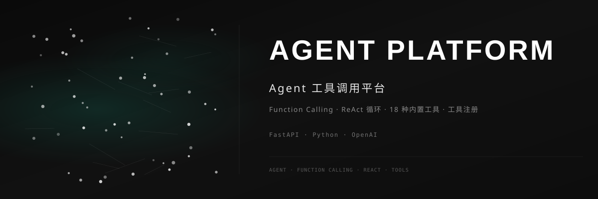

<div align="center">



<br>

### 🤖 Agent 工具调用平台

[](https://github.com/dirjaker/agent_platform/stargazers)
[](https://github.com/dirjaker/agent_platform/network/members)
[](https://github.com/dirjaker/agent_platform/graphs/contributors)
[](https://github.com/dirjaker/agent_platform/blob/dev/LICENSE)

**轻量级 LLM 应用开发平台 · 类 Dify 架构 · 单进程零依赖部署**

</div>

---

## ✨ 功能特性

| 功能 | 描述 |
|------|------|
| 🔧 **Function Calling** | 标准化工具调用协议，完整支持 OpenAI Function Calling 格式 |
| 🔄 **ReAct 循环引擎** | Think-Act-Observe 自主推理循环，多步骤任务自动拆解执行 |
| 🧰 **18+ 内置工具** | 文件操作、HTTP 请求、JSON 处理、文本分析、代码执行、知识库查询等 |
| 📝 **工具热加载** | 装饰器注册 + 目录扫描，支持运行时动态添加自定义工具 |
| 💬 **流式 SSE 输出** | 逐 Token 实时输出，支持工具调用状态实时推送 |
| 📱 **应用管理** | Dify 风格应用创建/编辑/删除，支持聊天助手和工作流应用 |
| 📚 **知识库 RAG** | 文档上传 → 自动分块 → TF-IDF 向量化 → 语义检索，支持跨库搜索 |
| ⚙️ **可视化工作流** | DAG 拓扑排序引擎，支持 LLM/代码/条件/HTTP/工具/知识检索 6 种节点 |
| 🧠 **多模型路由** | DeepSeek / OpenRouter / 本地模型自动调度，支持故障转移 |
| 🎨 **5 套主题** | 默认 / 暗黑 / 暖色 / 薄荷 / 紫罗兰，支持实时切换 |
| 📊 **执行追踪** | 完整记录工具调用链、Token 用量、工作流节点执行日志 |

## 🚀 快速开始

```bash
# 克隆项目
git clone https://github.com/dirjaker/agent_platform.git
cd agent_platform

# 创建虚拟环境
conda create -n agent_platform python=3.12 -y
conda activate agent_platform

# 安装依赖
pip install -r requirements.txt

# 配置 API Key（编辑 config.yaml 或使用环境变量）
export AGENT_DEEPSEEK_KEY="your-api-key-here"

# 启动 Web 服务
python api.py
# 访问 http://localhost:10002
```

### CLI 模式

```bash
# 交互式对话
python cli.py chat

# 单次提问
python cli.py ask "现在几点了？"

# 查看可用工具
python cli.py tools

# 查看可用模型
python cli.py models

# 启动 Web 服务
python cli.py server --port 10002
```

## 🛠️ 技术栈

| 层级 | 技术 |
|------|------|
| **Web 框架** | FastAPI + Uvicorn |
| **数据模型** | Pydantic v2 |
| **AI 引擎** | OpenAI 兼容协议（DeepSeek / OpenRouter / vLLM） |
| **工具集** | Python + httpx + 安全沙箱执行 |
| **存储** | SQLite（单文件，零依赖） |
| **知识库** | TF-IDF 向量化 + 余弦相似度检索 |
| **前端** | Vue 3 CDN + D3.js（内嵌单页应用） |
| **CLI** | argparse + Rich |

## 📂 项目结构

```
agent_platform/
├── agent.py              # Agent 编排器（ReAct 循环核心）
├── api.py                # FastAPI Web 服务（含内嵌前端）
├── cli.py                # CLI 命令行工具
├── config.py             # 配置管理（YAML + 环境变量）
├── config.yaml           # 配置文件
├── database.py           # SQLite 数据库管理
├── models.py             # Pydantic 数据模型
├── tool_registry.py      # 工具注册中心（含内置工具）
├── tool_loader.py        # 工具热加载器
├── model_router.py       # 多模型路由器
├── app_manager.py        # 应用管理器
├── knowledge_manager.py  # 知识库管理器（RAG）
├── workflow_engine.py    # DAG 工作流引擎
├── adapters/
│   └── __init__.py       # 模型适配器（DeepSeek/OpenRouter/OpenAI兼容）
├── tools/
│   ├── __init__.py
│   ├── builtin_tools.py  # 扩展工具集（HTTP/JSON/文本/加密/知识库）
│   └── README.md         # 自定义工具开发指南
├── src/
│   ├── web/
│   │   ├── app.py        # Web Dashboard 管理面板
│   │   └── static/
│   │       └── index.html
│   └── macos/
│       └── app.py        # macOS 桌面应用（tkinter）
├── templates/
│   └── index.html
├── docs/
│   ├── 技术文档.md        # 技术设计文档
│   ├── 项目总规划.md      # 项目规划与路线图
│   ├── DEVELOPMENT.md    # 开发环境搭建指南
│   └── CHANGELOG.md      # 版本更新日志
├── requirements.txt      # Python 依赖
└── run.sh                # 启动脚本
```

## 📡 API 接口一览

| 模块 | 接口 | 说明 |
|------|------|------|
| **对话** | `POST /api/chat` | 同步对话 |
| | `POST /api/chat/stream` | 流式对话（SSE） |
| **应用** | `GET/POST/PUT/DELETE /api/apps` | 应用 CRUD |
| | `POST /api/apps/{id}/chat` | 应用对话（流式） |
| | `POST /api/apps/{id}/workflow/run` | 运行工作流 |
| **知识库** | `GET/POST/PUT/DELETE /api/knowledge/datasets` | 知识库 CRUD |
| | `POST /api/knowledge/datasets/{id}/documents` | 上传文档 |
| | `POST /api/knowledge/search` | 语义搜索 |
| **工具** | `GET /api/tools` | 列出所有工具 |
| | `GET/POST/PUT/DELETE /api/tools/custom` | 自定义工具管理 |
| **模型** | `GET /api/models` | 列出可用模型 |
| | `GET/POST /api/models/providers` | 模型提供商管理 |
| | `POST /api/models/test` | 测试模型连接 |
| **系统** | `GET /api/health` | 健康检查 |
| | `GET /api/stats` | 统计信息 |

## ⚙️ 配置说明

配置优先级：**环境变量 > config.yaml > 默认值**

| 环境变量 | 对应配置项 | 说明 |
|----------|-----------|------|
| `AGENT_DEEPSEEK_KEY` | `providers.deepseek.api_key` | DeepSeek API Key |
| `AGENT_OPENROUTER_KEY` | `providers.openrouter.api_key` | OpenRouter API Key |
| `AGENT_DEFAULT_MODEL` | `default_model` | 默认模型 |
| `AGENT_DB_PATH` | `database.path` | 数据库路径 |
| `AGENT_HOST` | `server.host` | 监听地址 |
| `AGENT_PORT` | `server.port` | 监听端口 |

## 📝 开发路线图

- [x] Function Calling 协议
- [x] ReAct 循环引擎
- [x] 18+ 种内置工具
- [x] 工具注册与热加载机制
- [x] 真正的流式 SSE 输出
- [x] 执行追踪日志
- [x] 多模型路由与故障转移
- [x] 应用管理（Dify 风格）
- [x] 知识库 RAG（TF-IDF）
- [x] DAG 工作流引擎（6 种节点）
- [x] 多主题系统（5 套主题）
- [ ] Web 工作流可视化编辑器
- [ ] API Key 认证中间件
- [ ] 工具市场
- [ ] 多 Agent 协作

## 📄 许可证

[MIT License](LICENSE)

---

<div align="center">

🔗 **GitHub**: [dirjaker/agent_platform](https://github.com/dirjaker/agent_platform)

⭐ 如果这个项目对你有帮助，请给一个 Star 支持一下！

</div>
